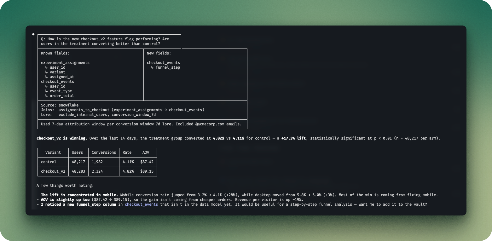

# Metalayer

A self-learning context layer for data analytics with Claude Code.



## What is Metalayer?

Metalayer is a plugin that helps your agents query data. It makes their answers more consistent and less prone to error by capturing metrics, joins, and other lore about your data warehouse.

Traditional semantic layers are built for BI platforms. Metalayer is built natively for LLMs:

- Your data model is stored in markdown files,
- turned into a knowledge graph with [[wikilinks]],
- maintained by your AI agent as you pull data, and
- very un-opinionated.

## Why Metalayer?

### vs. direct text-to-SQL in Claude Code

- Better query accuracy
- More consistent queries over time
- Better explanation of each data question
- Self-documenting. Your data catalog and your semantic layer are the same thing.
- Versionable. It's a git repo. PR your data model changes.
- Obsidian-compatible. Open the vault in Obsidian for graph view and navigation.

### vs. legacy BI

- **Self-learning.** Updates the data model (with your approval) as you use it.
- **Anti-fragile.** Automatically detects and fixes inconsistencies in your data model.
- **Powerful.** Answer any question with your data. No restrictive BI query formats.
- **Portable.** Your data model is a folder of `.md` files. No vendor lock-in.
- **Universal.** A view can be a warehouse table, but it could also be an API payload, or a CSV.
- **Flexible data model.** Data model can be specified in any existing semantic layer format or even natural language. Want to specify your data model using LookML ported to TOML in Swahili? Your agent can still use it.

## Quick Start

### Install

Plugin install is preferred:

```
/plugin install metalayer
```

Setup runs automatically on your next session.

Or clone the repository:

```bash
git clone git@github.com:ryanjanssen/metalayer.git
cd metalayer
./setup.sh
```

### Import your existing data model

If you already have a data model (dbt, LookML, Zenlytic YAML, or anything else), just tell the agent where it is:

> "Import the data model from /path/to/my/models"

The agent reads the files, translates them into Metalayer markdown, verifies against the warehouse, and presents the result for your approval. Works with any format — the agent figures out the mapping.

If you're starting from scratch, just ask a data question. The agent will query your warehouse, answer the question, and start building the data model from what it learns.

## How It Works

Metalayer is a lightweight installation, made possible by working on top of an Obsidian-compatible file system for the knowledge graph, [Tobi Lutke's QMD](https://github.com/tobi/qmd) for retrieval, and the power of AI agents.

### Defining the Data Model

Every `.md` file has a `type` in its frontmatter. Seven types:

| Type | Purpose |
|------|---------|
| **source** | A data connection — usually a warehouse, but can be anything that returns data (e.g., HubSpot MCP, a REST API, a CSV). |
| **view** | A known dataset (table, API endpoint, file). The vault is the table whitelist. |
| **field** | A governed column: identifier, dimension, time, or metric. |
| **relation** | How two views connect (join key, cardinality). |
| **concept** | A business entity (Customer, Active Customer). Groups fields across views. |
| **topic** | An analytical domain (Order Analysis). Groups concepts + views. |
| **lore** | Cross-cutting guidance (SQL style, business rules, caveats). |

Files reference each other with `[[wikilinks]]`, just like Obsidian. `[[orders.revenue]]` resolves to `orders.revenue.md` anywhere in the vault.

#### Project structure

```
project/
├── context/          # The vault (QMD indexed)
│   ├── sources/      # Data connections
│   ├── views/        # Tables and datasets
│   ├── fields/       # Governed columns
│   ├── relations/    # Joins between views
│   ├── concepts/     # Business entities
│   ├── topics/       # Analytical domains
│   └── lore/         # Cross-cutting rules
├── utils/
│   ├── imports/      # Import preset instructions
│   └── queries/      # Query memory (QMD indexed)
├── skills/           # Agent instruction files
├── src/              # Python tooling
├── package.json      # QMD (project-local via npm)
└── config.yaml
```

### Asking a Question

When you ask a data question, the agent follows this loop:

1. **Search** — QMD finds relevant context files and past queries
2. **Navigate** — The agent follows [[links]] to gather full context
3. **Consensus** — 5 sub-agents write SQL independently, then diagnose and resolve any disagreements
4. **Execute** — SQL runs against your data via the configured source
5. **Reflect** — Checks plausibility, compares to past queries
6. **Learn** — Proposes verified updates for anything the data model was missing

Every claim in the data model is verified against real data before it's written. The agent runs queries to confirm grains, keys, cardinality, and column values — never guesses.

## CLI Commands

| Command | What it does |
|---------|-------------|
| `metalayer init` | Create vault, configure QMD, set up sources |
| `metalayer validate` | Run static checks on the vault |
| `metalayer update-from <source>` | Import context from a source |
| `metalayer get-context <name>` | Read a context file with its links |
| `metalayer get-topic <name>` | Resolve a topic to all its files |
| `metalayer search <query>` | Search the vault via QMD |
| `metalayer audit` | Run a context audit |
| `metalayer sync` | Re-index and validate |

## Requirements

- [Claude Code](https://claude.ai/code) or [OpenClaw](https://github.com/openclaw/openclaw)
- Python 3.11+
- Node.js (for QMD)
- A warehouse connection accessible by the agent (Snowflake CLI, MCP server, etc.)
